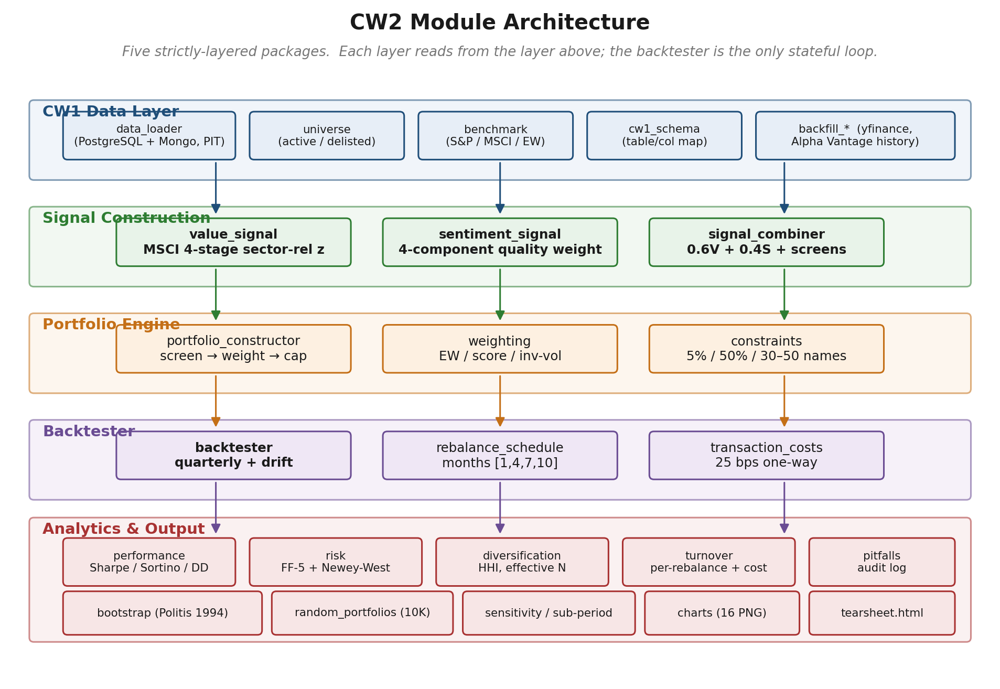
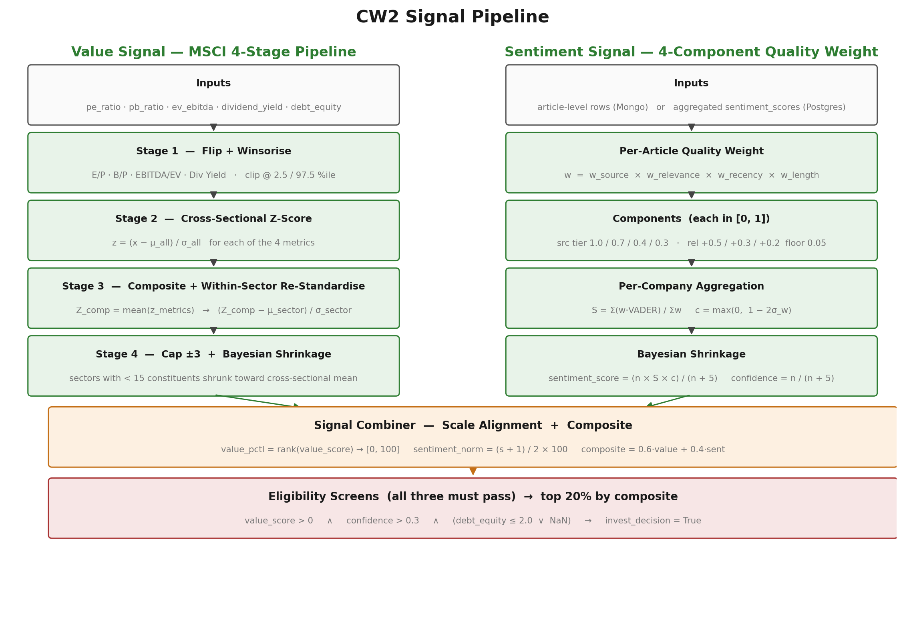
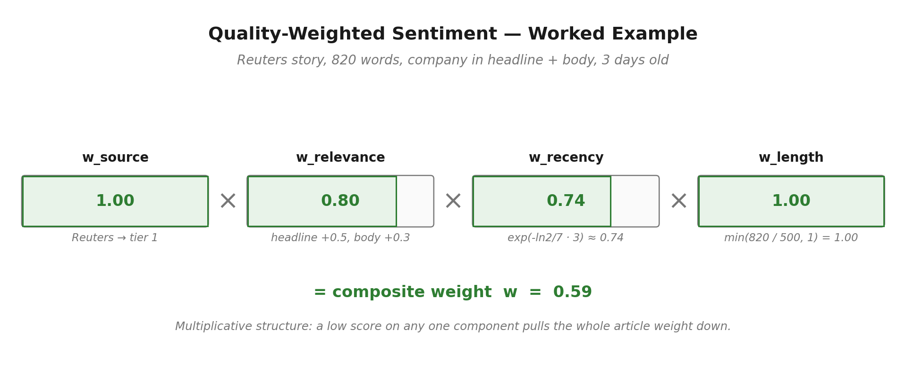
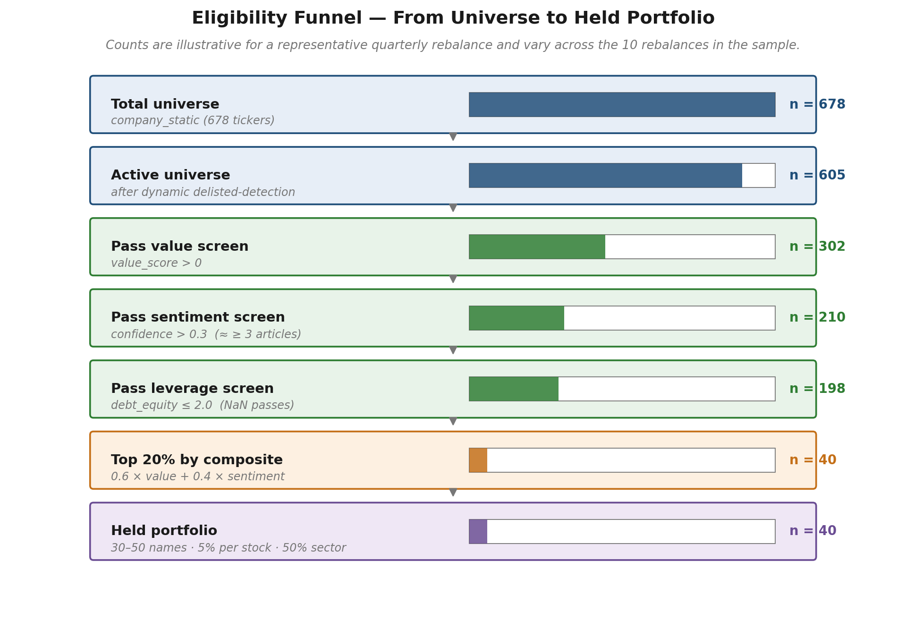
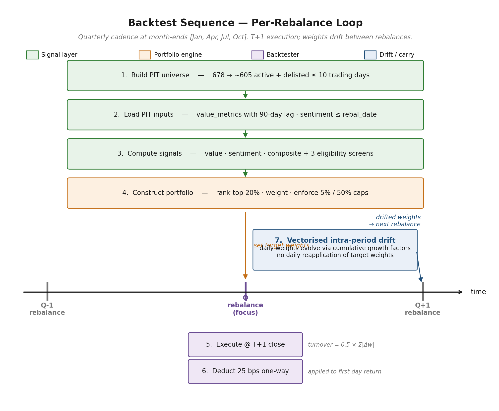

Code Documentation
==================

**UCL Institute of Finance & Technology — IFTE0003: Big Data in Quantitative Finance**

**Team 09 — Coursework 2 — Project Architecture**

This appendix documents the project architecture of the CW2 codebase. It
describes how the modules are organised, how data flows from the CW1
inputs through the signal-construction layer to the backtester, and which
module is responsible for each step of the methodology described in the
main report. The intent is to make the implementation traceable: every
methodological choice in Sections 3 to 8 of the main report corresponds
to a specific module listed below, and every module listed below has a
single, well-defined responsibility.

.. contents:: Document Structure
   :depth: 1
   :local:
   :backlinks: none

----

1. Project Architecture
-----------------------

The codebase is organised into five strictly-layered packages. Each
layer reads from the layer above and writes to the layer below; no
layer back-references the layer below it, and the backtester is the
only stateful loop in the pipeline. The layered design is what allows
each component to be specified, tested, and varied independently in
the robustness analysis of Section 10 of the main report.

   End-to-end module architecture of the CW2 codebase. Each layer reads
   from the layer above; the backtester is the only stateful loop in
   the pipeline. Module names match the Python package paths used in
   the source tree.

The five layers are:

* **CW1 Data Layer** — connects to the existing CW1 PostgreSQL and
  MongoDB instances, applies point-in-time filters, and constructs the
  active investable universe at each rebalancing date.
* **Signal Construction** — computes the sector-relative value score,
  the quality-weighted sentiment score, and the 60/40 composite score
  with eligibility screens. The methodological core of CW2.
* **Portfolio Engine** — applies the screen, ranks the survivors,
  assigns weights under the chosen scheme, and enforces the position
  and sector caps.
* **Backtester** — drives the quarterly rebalance loop, applies T+1
  execution, deducts 25 bps one-way transaction costs, and evolves
  daily portfolio weights through vectorised intra-period drift.
* **Analytics & Output** — computes performance, risk, factor
  attribution, diversification, and turnover metrics; runs the six
  robustness tests; and writes the final tables and charts to
  ``output/``.

----

2. Module Reference
-------------------

The following five tables list every module in the codebase, grouped
by layer, with a one-line statement of responsibility. *Section*
references point to the place in the main report where the
corresponding methodology is specified.

2.1 CW1 Data Layer
~~~~~~~~~~~~~~~~~~

.. list-table::
   :header-rows: 1
   :widths: 30 12 58

   * - Module
     - Section
     - Responsibility
   * - ``modules.data.data_loader``
     - 5
     - Reads CW1 PostgreSQL ``value_metrics`` and ``sentiment_scores``
       tables and the MongoDB ``raw_news_articles`` collection. Every
       SQL query and Mongo filter is constrained by
       ``date <= rebalance_date`` to enforce point-in-time discipline.
   * - ``modules.data.universe``
     - 5, 8
     - Builds the investable universe at each rebalancing date from
       ``company_static`` (678 tickers) and the active/delisted
       classification, retaining delisted tickers that traded within
       the 10 trading days before the rebalance.
   * - ``modules.data.benchmark``
     - 8, 9.1
     - Loads the three benchmark series (S&P 500, MSCI World Value,
       and the equal-weight universe benchmark) and aligns their
       calendars with the strategy return series.
   * - ``modules.data.cw1_schema``
     - 5
     - Single source of truth for CW1 table names, column names, and
       MongoDB collection names. Centralising these constants means
       any future CW1 schema change requires editing only this file.
   * - ``modules.data.backfill_real_yfinance_history``
     - 8
     - Reconstructs a real monthly history of fundamentals (Net
       Income, EBITDA, Total Debt, Common Stock Equity, Ordinary
       Shares, Cash, TTM dividends) from yfinance filings, since CW1
       stores only a single trailing-twelve-month snapshot per ratio.
   * - ``modules.data.backfill_real_alpha_vantage_sentiment``
     - 5
     - Optional historical sentiment backfill from Alpha Vantage when
       MongoDB article-level coverage is thin.

2.2 Signal Construction
~~~~~~~~~~~~~~~~~~~~~~~

.. list-table::
   :header-rows: 1
   :widths: 30 12 58

   * - Module
     - Section
     - Responsibility
   * - ``modules.signals.value_signal``
     - 3, 6.1
     - Implements the MSCI four-stage sector-relative value pipeline.
       Stages: (1) flip and winsorise ratios at 2.5 / 97.5 percentiles,
       excluding EV/EBITDA for Financials; (2) cross-sectional z-score
       across all stocks; (3) composite z-score and within-sector
       re-standardisation; (4) cap at ±3 standard deviations and
       Bayesian shrinkage for sectors with fewer than 15 constituents
       toward the cross-sectional mean.
   * - ``modules.signals.sentiment_signal``
     - 4, 6.2
     - Implements the four-component quality-weighted sentiment
       framework. Per-article weight is the product of source tier,
       relevance, recency, and length. Per-company aggregation
       applies the consistency multiplier ``c = max(0, 1 − 2σ)`` and
       Bayesian shrinkage ``S_final = (n × S × c) / (n + 5)``.
   * - ``modules.signals.signal_combiner``
     - 6.3, 7.2
     - Aligns scales (value z-score → percentile rank;
       sentiment → linear rescale to (0, 100)), forms the
       composite ``0.6 × value + 0.4 × sentiment``, applies the three
       eligibility screens, and flags the top 20% of eligible stocks
       as ``invest_decision = True``.

2.3 Portfolio Engine
~~~~~~~~~~~~~~~~~~~~

.. list-table::
   :header-rows: 1
   :widths: 30 12 58

   * - Module
     - Section
     - Responsibility
   * - ``modules.portfolio.portfolio_constructor``
     - 7.2 – 7.4
     - Top-level orchestrator for the screen → rank → weight → cap
       pipeline at each rebalance. Returns the final target-weight
       vector that the backtester consumes.
   * - ``modules.portfolio.weighting``
     - 7.3
     - Three weighting schemes — equal weight (1/N), composite-score
       weight, and inverse-volatility weight. The empirical comparison
       in Section 9 reports their realised performance side by side.
   * - ``modules.portfolio.constraints``
     - 7.4
     - Hard caps on the final weight vector: 5% per individual stock,
       50% per GICS sector, with the holdings count constrained to
       the 30–50 range.

2.4 Backtester
~~~~~~~~~~~~~~

.. list-table::
   :header-rows: 1
   :widths: 30 12 58

   * - Module
     - Section
     - Responsibility
   * - ``modules.backtest.backtester``
     - 8
     - Drives the quarterly rebalance loop. At each rebalance date
       it builds the point-in-time universe, runs the signal-and-
       portfolio pipeline, and sets new target weights at the T+1
       close. Daily portfolio weights evolve via vectorised
       cumulative growth factors so intra-period drift is computed
       closed-form rather than reapplied each day.
   * - ``modules.backtest.rebalance_schedule``
     - 8
     - Generates the quarterly rebalancing dates at the ends of
       January, April, July, and October over the 2023–2025 sample.
   * - ``modules.backtest.transaction_costs``
     - 7.6, 8
     - Flat per-trade cost model: 25 basis points one-way baseline
       deducted from returns on the first trading day after the
       rebalance, with a 50 bps stress-test path also recorded.
       Turnover is measured as ``0.5 × Σ|Δw|``.

2.5 Analytics and Output
~~~~~~~~~~~~~~~~~~~~~~~~

.. list-table::
   :header-rows: 1
   :widths: 30 12 58

   * - Module
     - Section
     - Responsibility
   * - ``modules.analytics.performance``
     - 9.1, 9.3
     - Annualised return, annualised volatility, Sharpe, Sortino,
       Calmar, maximum drawdown, drawdown duration and recovery,
       monthly returns heatmap, rolling 12-month Sharpe.
   * - ``modules.analytics.risk``
     - 9.4
     - Historical VaR and CVaR at the 95% and 99% levels, and the
       Fama-French five-factor regression with Newey-West HAC
       standard errors at six lags.
   * - ``modules.analytics.diversification``
     - 9.5
     - HHI, effective N, sector concentration, and the per-rebalance
       holdings count and sector breadth.
   * - ``modules.analytics.turnover``
     - 9.5
     - Per-rebalance one-way turnover, average quarterly and
       annualised turnover, cumulative trading-cost drag.
   * - ``modules.analytics.pitfalls``
     - 8
     - Backtest pitfalls audit (Table 8.1): the location of each
       resolution and a status flag.
   * - ``modules.robustness.bootstrap``
     - 10.5
     - Stationary block bootstrap (Politis and Romano, 1994) with
       geometric block lengths, 2,500 replications, returning 95%
       confidence intervals for Sharpe, return, volatility, and
       maximum drawdown.
   * - ``modules.robustness.random_portfolios``
     - 10.6
     - 10,000-sample random-portfolio benchmarking with matched
       holding counts and the same 25 bps transaction cost.
   * - ``modules.robustness.sensitivity``
     - 10.2 – 10.4, 10.7
     - Weight grid (21 variants), threshold grid (20 combinations),
       sub-period decomposition, leave-one-sector-out attribution.
   * - ``modules.visualization.charts``
     - 9
     - Generates the 16 PNG charts referenced in Section 9.
   * - ``modules.visualization.tearsheet``
     - 9
     - Produces the QuantStats HTML tearsheet appended as Appendix D.

----

3. Signal Construction
----------------------

The signal-construction layer is the principal methodological
contribution of CW2. :numref:`signal-pipeline` shows the algorithmic
flow: the four-stage MSCI sector-relative value pipeline on the left,
the four-component quality-weighted sentiment pipeline on the right,
and the combiner that produces the composite score and applies the
three eligibility screens at the bottom.

.. _signal-pipeline:

   Signal construction pipeline. Value and sentiment are constructed
   in parallel and merged at the combiner; only stocks that pass all
   three eligibility screens enter the ranked candidate pool.

3.1 Sector-Relative Value (``value_signal``)
~~~~~~~~~~~~~~~~~~~~~~~~~~~~~~~~~~~~~~~~~~~~

The four stages run sequentially on the cross-section of active
companies at each rebalancing date.

.. code-block:: text
   :caption: Sector-relative value scoring (pseudocode)

   procedure compute_value_score(companies, gics_sectors):

       # ---- Stage 1: Flip and winsorise --------------------------
       for each company c in companies:
           c.ep        = 1 / c.pe_ratio       if c.pe_ratio    > 0 else NaN
           c.bp        = 1 / c.pb_ratio       if c.pb_ratio    > 0 else NaN
           c.ebitda_ev = 1 / c.ev_ebitda      if c.ev_ebitda   > 0 else NaN
           c.div_yield = c.dividend_yield                                # already directional
           if c.gics_sector == "Financials":
               c.ebitda_ev = NaN                                         # MSCI carve-out
       for metric in {ep, bp, ebitda_ev, div_yield}:
           lo, hi = quantile(metric, 0.025), quantile(metric, 0.975)
           winsorise metric to [lo, hi]

       # ---- Stage 2: Cross-sectional z-score ---------------------
       for metric in {ep, bp, ebitda_ev, div_yield}:
           z[metric] = (metric - mean_all(metric)) / std_all(metric)

       # ---- Stage 3: Composite + within-sector re-standardise ----
       for each company c:
           c.Z_comp = mean of available z[metric] for c
       for each sector s in gics_sectors:
           members = {c : c.gics_sector == s}
           if len(members) >= 3:
               c.Z_sec_rel = (c.Z_comp - mean(members.Z_comp))
                             / std(members.Z_comp)
           else:
               c.Z_sec_rel = 0                                            # too small to standardise

       # ---- Stage 4: Cap and Bayesian shrinkage ------------------
       for each company c:
           c.value_score = clip(c.Z_sec_rel, -3, +3)
           n = size of c's sector
           if n < 15:                                                     # k_sector = 15
               c.value_score *= n / (n + 15)                              # shrink toward cross-sectional mean

       return {c.company_id: c.value_score for c in companies}

The shrinkage factor in Stage 4 is the standard Bayesian-empirical
form: as the sector size *n* grows, ``n / (n + k)`` approaches one and
the within-sector estimate is preserved; when *n* is small the score
collapses toward the cross-sectional mean (zero, by construction of
Stage 2).

3.2 Quality-Weighted Sentiment (``sentiment_signal``)
~~~~~~~~~~~~~~~~~~~~~~~~~~~~~~~~~~~~~~~~~~~~~~~~~~~~~

Each article receives a multiplicative quality weight composed of four
independent components, each in [0, 1]. :numref:`quality-weight`
illustrates the calculation for a representative article.

.. _quality-weight:

   Worked example of the four-component quality weight for a single
   article. The multiplicative structure ensures that a low score on
   any one dimension pulls the whole article weight down: a tier-1
   source with no headline mention or stale recency cannot inherit
   the weight that a clean tier-1 article would receive.

.. code-block:: text
   :caption: Article-level quality weight (pseudocode)

   function quality_weight(article, rebalance_date):

       # Source credibility — domain tier lookup
       tier = source_tier(article.domain)         # tier 1/2/3/default
       w_source = {tier1: 1.0, tier2: 0.7, tier3: 0.4, default: 0.3}[tier]

       # Relevance — additive on three indicators with floor at 0.05
       r = 0.0
       if company_in_text(article.headline):    r += 0.5
       if company_in_text(article.body):        r += 0.3
       if article.word_count >= 500:            r += 0.2
       w_relevance = clip(r, 0.05, 1.0)

       # Recency — exponential decay with 7-day half-life
       days_old   = max(0, rebalance_date - article.published_at)
       w_recency  = exp(-ln(2) / 7 * days_old)

       # Length — linear up to 500 words, capped at 1.0
       w_length   = min(article.word_count / 500, 1.0)

       return w_source * w_relevance * w_recency * w_length

Per-company aggregation combines the article-level weights into a
single shrunk sentiment score and a confidence statistic.

.. code-block:: text
   :caption: Per-company sentiment aggregation (pseudocode)

   function company_sentiment(company_articles, rebalance_date):

       n = len(company_articles)
       if n == 0:
           return (sentiment_score: 0.0, confidence: 0.0)

       w     = [quality_weight(a, rebalance_date) for a in company_articles]
       v     = [a.vader_compound for a in company_articles]

       # Weighted mean of VADER compound scores
       S     = sum(w_i * v_i) / sum(w_i)

       # Consistency multiplier — penalises sentiment dispersion
       sigma = sqrt(sum(w_i * (v_i - S)^2) / sum(w_i))
       c     = max(0, 1 - 2 * sigma)

       # Bayesian shrinkage toward zero (k_sentiment = 5)
       S_final    = (n * S * c) / (n + 5)
       confidence = n / (n + 5)

       return (sentiment_score: S_final, confidence: confidence)

The shrinkage parameter ``k = 5`` means a company with five articles
receives roughly 50% weight on its observed sentiment and 50% on the
neutral prior. A company with twenty or more articles retains over
80% of the observed signal.

3.3 Composite Score and Eligibility (``signal_combiner``)
~~~~~~~~~~~~~~~~~~~~~~~~~~~~~~~~~~~~~~~~~~~~~~~~~~~~~~~~~

The combiner aligns the two scores to a common scale, builds the
composite, and applies the three eligibility screens.

.. code-block:: text
   :caption: Composite score and eligibility screen (pseudocode)

   function build_candidates(value_scores, sentiment_scores, fundamentals):

       # Scale alignment — make value and sentiment comparable
       value_pctl     = percentile_rank(value_scores)              # → [0, 100]
       sentiment_norm = (sentiment_scores + 1) / 2 * 100           # → [0, 100]

       # Composite — 60% value, 40% sentiment
       composite = 0.6 * value_pctl + 0.4 * sentiment_norm

       # Eligibility — three screens, all must pass
       for each company c:
           c.pass_value      = (c.value_score > 0)
           c.pass_sentiment  = (c.confidence > 0.3)
           c.pass_leverage   = isnan(c.debt_equity) or (c.debt_equity <= 2.0)
           c.is_eligible     = c.pass_value and c.pass_sentiment and c.pass_leverage

       eligible = [c for c in companies if c.is_eligible]

       # Rank survivors by composite, flag top 20%
       eligible.sort(key=composite, descending=True)
       cutoff = max(1, floor(0.20 * len(eligible)))
       for c in eligible[:cutoff]:
           c.invest_decision = True

       return eligible

----

4. Portfolio Engine
-------------------

The portfolio engine takes the candidate set produced by the combiner
and turns it into a held portfolio under the weighting and constraint
rules specified in Section 7 of the main report.
:numref:`eligibility-funnel` shows how the universe shrinks at each
stage.

.. _eligibility-funnel:

   Eligibility funnel for a representative quarterly rebalance. The
   universe shrinks at each stage: the active filter removes delisted
   names, the three signal screens remove ineligible candidates, and
   the top-20% rule selects the held portfolio. Counts vary across
   the 10 rebalances in the sample.

The portfolio constructor pseudocode is:

.. code-block:: text
   :caption: Portfolio construction (pseudocode)

   function construct_portfolio(candidates, weighting_scheme):

       # Rank survivors and select the top quintile
       ranked    = sort_by(candidates.composite, descending=True)
       n         = max(1, floor(0.20 * len(ranked)))
       selected  = ranked[:n]

       # Assign raw weights
       if weighting_scheme == "equal_weight":
           for c in selected: c.w = 1 / n
       elif weighting_scheme == "score_weight":
           for c in selected: c.w = c.composite / sum(selected.composite)
       elif weighting_scheme == "inv_volatility":
           inv_sigma = [1 / c.realised_vol_252d for c in selected]
           for c, iv in zip(selected, inv_sigma):
               c.w = iv / sum(inv_sigma)

       # Enforce constraints — iterate until both caps are satisfied
       repeat:
           for c in selected:
               c.w = min(c.w, 0.05)                     # 5% per-stock cap
           sector_w = group_sum(c.w by c.gics_sector)
           for s, w_s in sector_w.items():
               if w_s > 0.50:
                   for c in selected where c.gics_sector == s:
                       c.w *= 0.50 / w_s                # scale down
           renormalise so that sum(c.w) == 1.0
       until no cap is violated

       return {c.company_id: c.w for c in selected}

----

5. Backtester
-------------

:numref:`backtest-sequence` shows the per-rebalance loop on a
horizontal time axis. Steps 1–4 build the new target weight vector;
step 5 executes at the T+1 close; step 6 deducts transaction costs;
step 7 evolves daily weights vectorially through the inter-rebalance
period.

.. _backtest-sequence:

   Backtest sequence diagram. The signal and portfolio pipelines run
   *before* the rebalance date; execution happens at the T+1 close;
   weights drift vectorially between rebalances and the drifted state
   carries forward into the next rebalance.

5.1 Rebalance Loop (``backtester``)
~~~~~~~~~~~~~~~~~~~~~~~~~~~~~~~~~~~

.. code-block:: text
   :caption: Backtest driver loop (pseudocode)

   function run_backtest(start_date, end_date, config):

       rebalances     = quarterly_dates(start_date, end_date)   # [Jan, Apr, Jul, Oct]
       w_current      = empty                                   # current held weights
       portfolio_ret  = empty time series

       for t in rebalances:

           # 1. PIT universe and inputs at the rebalance date
           universe   = build_universe(t, lookback_days=10)            # 678 → ~605
           value_df   = load_value_metrics(universe, t,
                                           reporting_lag_days=90)
           sent_df    = load_sentiment(universe, t)                    # published_at <= t

           # 2. Compute signals
           v_score    = value_signal.compute(value_df, gics_sector_map)
           s_score    = sentiment_signal.compute(sent_df, t)

           # 3. Combine, screen, rank
           candidates = signal_combiner.compute(v_score, s_score, value_df)

           # 4. Construct new target portfolio
           w_target   = portfolio_constructor.construct(candidates,
                                                        scheme="equal_weight")

           # 5. Execute at the T+1 close, measure turnover
           t_exec     = next_trading_day(t)
           turnover   = 0.5 * sum(|w_target_i - w_current_i| for i)
           cost       = 0.0025 * turnover                              # 25 bps one-way

           # 6. Apply cost on first day after rebalance
           portfolio_ret[t_exec] = (w_target dot daily_return[t_exec]) - cost

           # 7. Vectorised intra-period drift to next rebalance
           t_next     = next_rebalance(t)
           prices     = adj_close[t_exec : t_next, w_target.index]
           growth     = cumulative_product(1 + daily_return)
           daily_w    = (w_target * growth_factor) / sum_axis_1
           daily_ret  = sum(daily_w * daily_return, axis=1)
           portfolio_ret[t_exec : t_next] = daily_ret

           w_current  = daily_w[-1]                                    # drifted end-of-period

       return portfolio_ret

The drift in step 7 is closed-form: each day's weight vector is the
previous day's weight vector multiplied by ``(1 + r_i)`` and
renormalised to sum to one. Target weights are not re-applied each
day — that would silently re-introduce alpha that the strategy never
actually traded.

5.2 Transaction Costs (``transaction_costs``)
~~~~~~~~~~~~~~~~~~~~~~~~~~~~~~~~~~~~~~~~~~~~~

.. code-block:: text
   :caption: Transaction-cost model (pseudocode)

   function transaction_cost(w_old, w_new, bps_one_way=25):
       turnover = 0.5 * sum(abs(w_new_i - w_old_i) for i in union(w_old, w_new))
       return (bps_one_way / 10000) * turnover

The factor of one-half converts the round-trip *gross* turnover into
the *one-way* turnover that the 25 bps rate is quoted against.

----

6. Robustness Layer
-------------------

The robustness layer wraps the backtester with parameter perturbations
and statistical resampling. The methodological choices are summarised
in Section 10 of the main report; the algorithmic structure of the
two non-trivial estimators is reproduced below.

6.1 Stationary Block Bootstrap (``robustness.bootstrap``)
~~~~~~~~~~~~~~~~~~~~~~~~~~~~~~~~~~~~~~~~~~~~~~~~~~~~~~~~~

.. code-block:: text
   :caption: Stationary block bootstrap (pseudocode)

   function stationary_bootstrap(returns, n_replications=2500, mean_block=20):
       T = len(returns)
       p = 1 / mean_block                  # geometric block-restart probability
       sharpes = empty list

       for r in 1 .. n_replications:
           sample = empty time series of length T
           i = random integer in [0, T)
           for t in 0 .. T-1:
               sample[t] = returns[i]
               if uniform(0, 1) < p:
                   i = random integer in [0, T)        # restart block
               else:
                   i = (i + 1) mod T                   # extend block
           sharpes.append(annualised_sharpe(sample))

       return {
           "point":     annualised_sharpe(returns),
           "ci_lower":  quantile(sharpes, 0.025),
           "ci_upper":  quantile(sharpes, 0.975),
           "p_positive": mean(sharpes > 0),
       }

The geometric block length preserves the autocorrelation structure of
daily returns while ensuring the resampled series is itself stationary
(unlike a fixed-block bootstrap, which has discontinuities at every
block boundary).

6.2 Random Portfolios (``robustness.random_portfolios``)
~~~~~~~~~~~~~~~~~~~~~~~~~~~~~~~~~~~~~~~~~~~~~~~~~~~~~~~~

.. code-block:: text
   :caption: Random-portfolio benchmarking (pseudocode)

   function random_portfolio_rank(strategy_returns, universe, n_simulations=10_000):
       strategy_sharpe = annualised_sharpe(strategy_returns)
       random_sharpes  = empty list

       for sim in 1 .. n_simulations:
           # Match the strategy's holding count at every rebalance
           random_returns = empty time series
           for t in rebalances:
               n_t = strategy_holdings_count(t)
               sampled = random_choice(universe, k=n_t, replace=False)
               w       = 1 / n_t                                # equal weight
               cost    = 0.0025 * 0.5 * |Δw|                    # 25 bps one-way
               random_returns[t : next_rebalance(t)] = (
                   period_return(sampled, w) - cost
               )
           random_sharpes.append(annualised_sharpe(random_returns))

       percentile = mean(strategy_sharpe > random_sharpes) * 100
       return percentile

Matching the holding count at every rebalance is what makes the test
informative: a high-conviction 5-name portfolio has a very different
random-baseline distribution than a diversified 50-name portfolio.

----

7. Configuration
----------------

All tunable parameters live in ``config/backtest_config.yaml`` so
that no value used by the methodology is hard-coded inside logic
modules. The principal parameters and their report references are:

.. list-table::
   :header-rows: 1
   :widths: 38 18 44

   * - Parameter
     - Value
     - Report reference
   * - ``scoring.value_weight`` / ``sentiment_weight``
     - 0.60 / 0.40
     - Section 6.3 composite weighting; sensitivity in Section 10.2
   * - ``scoring.selection_percentile``
     - 0.20
     - Section 7.2 top-20% selection
   * - ``scoring.max_debt_equity``
     - 2.0
     - Section 7.2 leverage cap (NaN treated as passing)
   * - ``scoring.min_sentiment_confidence``
     - 0.3
     - Section 6.3 / 7.2 sentiment confidence screen
   * - ``scoring.shrinkage_k_sentiment``
     - 5
     - Section 4.3 Bayesian shrinkage on sentiment
   * - ``portfolio.max_position_weight``
     - 0.05
     - Section 7.4 per-stock cap
   * - ``portfolio.max_sector_weight``
     - 0.50
     - Section 7.4 sector cap
   * - ``costs.transaction_cost_bps``
     - 25
     - Section 7.6 one-way transaction cost
   * - ``backtest.rebalance_months``
     - [1, 4, 7, 10]
     - Section 8 quarterly rebalancing
   * - ``backtest.reporting_lag_days``
     - 90
     - Section 8 point-in-time accounting lag

----

8. Reproducibility
------------------

The complete pipeline is launched from a single entry point:

.. code-block:: bash

   poetry run python Main_CW2.py --config config/backtest_config.yaml

After a successful run, ``output/`` contains:

* ``output/tables/`` — performance summary, Fama-French regression,
  bootstrap confidence intervals, weight and threshold sensitivity
  grids, sector attribution, sub-period analysis, and the appendices
  referenced in the main report.
* ``output/charts/`` — the 16 PNG charts referenced in Section 9 and
  the QuantStats HTML tearsheet.

The unit and integration test suite (``tests/``) covers signal
construction, portfolio construction, the backtester, the analytics
modules, and the robustness modules:

.. code-block:: bash

   poetry run pytest tests/ -v --cov=modules

Test coverage is reported alongside the code-quality appendix
(Appendix G of the main report).

----

9. Backtest Pitfalls Audit
--------------------------

The backtest pitfalls table reproduced as Table 8.1 in the main report
is generated from ``modules.analytics.pitfalls`` at runtime. Every
classical backtesting pitfall is mapped to the module path that
implements its mitigation, with a PASS/FAIL flag. The audit covers:

* look-ahead bias,
* survivorship bias,
* execution-timing optimism,
* zero-transaction-cost bias,
* static-weight return calculation (intra-period drift),
* sector concentration in HML-style construction,
* overweighting of wire-copy news,
* static or stale sentiment,
* multiple-testing and data snooping,
* IID-bootstrap mis-specification (addressed by the stationary block
  bootstrap),
* OLS standard-error mis-specification (addressed by Newey-West HAC),
* concentration risk hidden by averages,
* backtest length too short for regime coverage.

All thirteen items pass within the current codebase.
